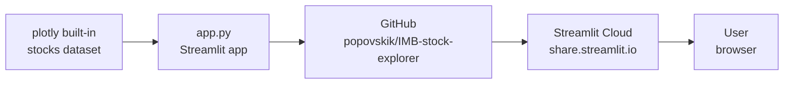

# 📈 Stock Price Explorer

An interactive Streamlit app that visualises normalised Big Tech stock prices since January 2018.

**Live app:** https://imb-stock-explorer.streamlit.app/

## Architecture



## Features

- Sidebar multiselect to compare any combination of 6 big tech stocks (AAPL, MSFT, GOOG, AMZN, FB, NFLX)
- Normalised line chart showing growth since Jan 2018
- Best performer metric — highlights the top-growing stock and its % gain
- "Did you know?" fact banner powered by `st.info()`

## Stack

| Layer | Tool |
|-------|------|
| Data | `plotly.express.data.stocks()` — no API key needed |
| App | Python · Streamlit |
| Hosting | Streamlit Community Cloud |
| Version control | GitHub |

## Run locally

```bash
pip install -r requirements.txt
streamlit run app.py
```
