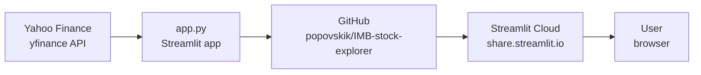

# 📈 Stock Price Explorer

An interactive Streamlit app that lets you explore and compare any publicly traded stock — powered by live Yahoo Finance data.

**Live app:** https://imb-stock-explorer.streamlit.app/

## Architecture



## Features

- **Any ticker** — search any publicly traded stock, ETF, or crypto (e.g. NVDA, BTC-USD, TSM)
- **Sector presets** — Big Tech, Finance, Energy, Healthcare, ETFs
- **Date range** — adjustable From/To date pickers
- **S&P 500 benchmark** — each stock card shows whether it beats or trails the S&P 500
- **Investment calculator** — enter any dollar amount to see what it would be worth today
- **Rotating facts** — 10 "Did you know?" facts that cycle on demand
- **Price chart tab** — normalised line chart + total growth bar chart with S&P reference line
- **Correlation tab** — daily return heatmap showing how selected stocks move together
- **Fun stats tab** — current win/loss streak per stock + annualised volatility comparison
- **Around design system** — Poppins/Inter fonts, brand orange accent (#FF4800), warm neutral theme

## Stack

| Layer | Tool |
|-------|------|
| Data | `yfinance` — live Yahoo Finance data, any ticker |
| App | Python · Streamlit |
| Charts | Plotly Express |
| Theme | Around Design System (Poppins, Inter, #FF4800) |
| Hosting | Streamlit Community Cloud |
| Version control | GitHub |

## Run locally

```bash
pip install -r requirements.txt
streamlit run app.py
```
